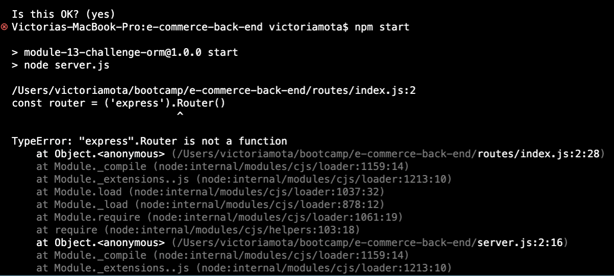
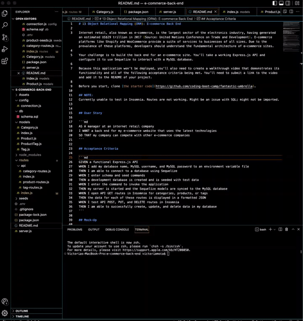

# 13 Object Relational Mapping (ORM): E-commerce Back End

Internet retail, also known as e-commerce, is the largest sector of the electronics industry, having generated an estimated US$29 trillion in 2017 (Source: United Nations Conference on Trade and Development). E-commerce platforms like Shopify and WooCommerce provide a suite of services to businesses of all sizes. Due to the prevalence of these platforms, developers should understand the fundamental architecture of e-commerce sites.

Your challenge is to build the back end for an e-commerce site. You’ll take a working Express.js API and configure it to use Sequelize to interact with a MySQL database.

Because this application won’t be deployed, you’ll also need to create a walkthrough video that demonstrates its functionality and all of the following acceptance criteria being met. You’ll need to submit a link to the video and add it to the README of your project.

Before you start, clone [the starter code](https://github.com/coding-boot-camp/fantastic-umbrella).

## NOTE:
Currently unable to test in Insomnia. Routes are not working. Might be an issue with SQL; might not be imported.


## User Story

```md
AS A manager at an internet retail company
I WANT a back end for my e-commerce website that uses the latest technologies
SO THAT my company can compete with other e-commerce companies
```

## Acceptance Criteria

```md
GIVEN a functional Express.js API
WHEN I add my database name, MySQL username, and MySQL password to an environment variable file
THEN I am able to connect to a database using Sequelize
WHEN I enter schema and seed commands
THEN a development database is created and is seeded with test data
WHEN I enter the command to invoke the application
THEN my server is started and the Sequelize models are synced to the MySQL database
WHEN I open API GET routes in Insomnia for categories, products, or tags
THEN the data for each of these routes is displayed in a formatted JSON
WHEN I test API POST, PUT, and DELETE routes in Insomnia
THEN I am able to successfully create, update, and delete data in my database
```

## Preview



## Demo



## Getting Started

This Challenge will require a video submission. Refer to the [Fullstack Blog Video Submission Guide](https://coding-boot-camp.github.io/full-stack/computer-literacy/video-submission-guide) for additional guidance on creating a video.

You’ll need to use the [MySQL2](https://www.npmjs.com/package/mysql2) and [Sequelize](https://www.npmjs.com/package/sequelize) packages to connect your Express.js API to a MySQL database and the [dotenv package](https://www.npmjs.com/package/dotenv) to use environment variables to store sensitive data, like your MySQL username, password, and database name.

Use the `schema.sql` file in the `db` folder to create your database using MySQL shell commands. Use environment variables to store sensitive data, like your MySQL username, password, and database name.

### Sync Sequelize to the Database on Server Start

Create the code needed in `server.js` to sync the Sequelize models to the MySQL database on server start.
